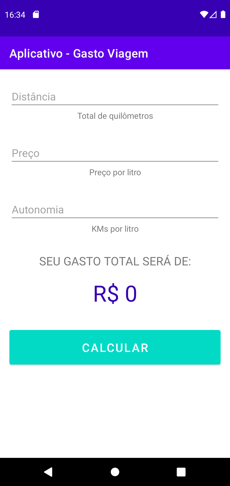
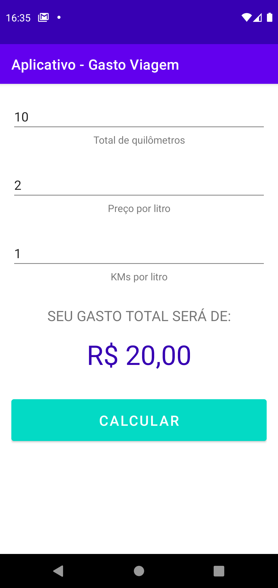

## GastoViagem-app-android

### 📄 Descrição:

Aplicativo Android, desenvolvido com Kotlin, para efetuar o cálculo de gastos com gasolina em viagens, baseando-se em:

- total de quilometros
- preço por litro
- KM's por litro

##

### 📲 Layout:

- tela inicial - sem dados inseridos e sem cálculo efetuado:
<h1>
  
</h1>
 

- tela posterior - com os dados inseridos e o cálculo efetuado:
<h1>
  
</h1>

### 📍 Autora:

- NATHÁLIA MIRIAM
- LinkedIn: https://www.linkedin.com/in/nathaliamiriam/
- Portfólio: https://nathaliamiriam.github.io/
